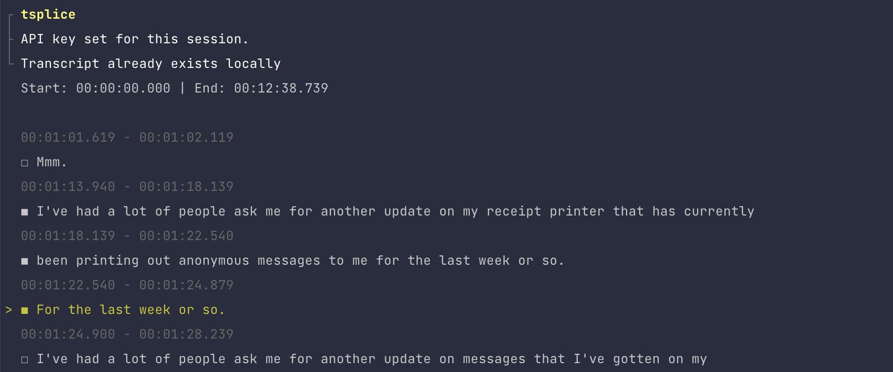

# tsplice 

A modest command-line application to **splice** and merge video files from the **t**erminal.



:construction: This is an experimental app so you might see some weird bugs. If so, [let me know](https://github.com/aschmelyun/tsplice/issues)! :construction:

## Installation

To install, download the latest [release binary](https://github.com/aschmelyun/tsplice/releases/latest) to your system. If you're on Linux or MacOS, you can use this one-liner to handle that:

```
sudo curl -L https://github.com/aschmelyun/tsplice/releases/download/v1.0.3/tsplice-v1.0.3-darwin-arm64 -o /usr/local/bin/tsplice && sudo chmod +x /usr/local/bin/tsplice
```

> [!NOTE]
> The release above is for Apple Chip MacOS machines, be sure to change the link in the curl call to the appropriate binary for your system.

## Requirements

You'll need to have the following software installed on your system to use `tsplice` effectively:

- ffmpeg
- mpv

Additionally, you'll need to have an [OpenAI API key](https://platform.openai.com/api-keys) ready to be set on the first run.

## Usage

Run `tsplice` in any terminal window, followed by the file that you want to edit.

```sh
tsplice ./Movies/my_facecam_vid_20250629.mp4
```

Additionally, you can pass in some options between the command and the video file. The ones available are:

- `lang`: (optional, string) sets the language for the transcription, if you want to prompt the model to make it easier to transcribe
- `prompt`: (optional, string) sets a prompt for the Whisper model, if you want to provide extra context to the model during transcription
- `gate`: (optional, bool) removes blocks of 10+ seconds of silence from the audio before sending off for transcription

A command using some of these might look like:

```sh
tsplice --gate --lang=fr ./Movies/my_facecam_vid_20250629.mp4
```

At any time, you can get a help screen by running just `tsplice` or `tsplice --help`. You can see the current version installed by running `tsplice --version`. 

## How it works

This app performs a few basic steps:

1. Extract audio from the video using `ffmpeg`
2. Send the audio to OpenAI's Whisper API for transcription
3. Save the transcription to a local file
4. Parse the transcription into individual lines and add it to a checklist
5. Take the selected checklist items and compile them to a list of timestamps
6. Merge together the final video with `ffmpeg` and the timestamp list above

That's it! Your spliced video will be available in the same directory as your original.
